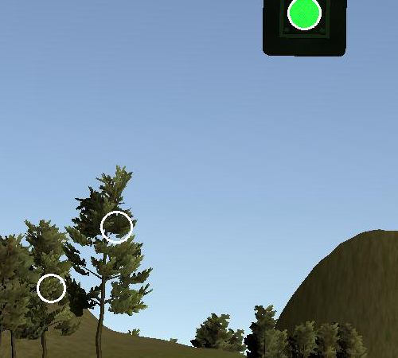

# Writeup (ROS: System Integration Project)

> DATE: '21.2/19  
> Project Rubrics: [Requirement](https://review.udacity.com/#!/rubrics/3058/view)  
> AUTHOR: sSungwookLEE (joker1251@naver.com)

## 1. INTRODUCTION

This project is for autonomous driving including Waypointer Loader/Updater/Follower, Throttle/Brake/Steering Controller, TrafficLight/Object Detector Module was implemented under ROS(robot operating system) by myself.  
In order to fully understand this project, ROS knowledge will be needed. [ROS wiki is here](http://wiki.ros.org/)  
In this project, except Object Detector module, all are implemented. Overall structure of this project is as below.


The module is consist of the 3 parts: Perception, Planning, Control parts.  
First, Planning is charge of generating the final waypoint composed of position x and y, desired linear velocity, desired yawrate ... . Also following the traffic_waypoint and obstacle_waypoint topic, the final waypoint is updated. Final waypoint is published to each ros_node.  
Second, Perception is charge of perceive the surround situation such as vehicle object in front of the ego, and traffic light. After that, those each node publish the waypoint information to the node 'waypoint updater node'.  
Thrid, Control is charge of control the throttle, brake, steering input according to generating waypoint. In this project, it is implemented through the PID controller.

## 2. MAIN

In this chapter, the source code of each ros-node will be explained.

### 2-1. Planning Part: _waypoint_updater.py_

```python
class WaypointUpdater(object):
    def __init__(self):

        rospy.init_node('waypoint_updater')
        self.MAX_DECEL = rospy.get_param('~MAX_DECEL', 8.)

        self.pose = None
        self.base_waypoints = None
        self.waypoints_2d = None
        self.waypoint_tree = None
        self.stopline_wp_idx = -1

        self.LOOKAHEAD_WPS = rospy.get_param('~LOOKAHEAD_WPS', 100)

        rospy.Subscriber('/current_pose', PoseStamped, self.pose_cb)
        rospy.Subscriber('/base_waypoints', Lane, self.waypoints_cb)
        # TODO: Add a subscriber for /traffic_waypoint and /obstacle_waypoint below'
        rospy.Subscriber('/traffic_waypoint', Int32, self.traffic_cb)

        self.final_waypoints_pub = rospy.Publisher(
            'final_waypoints', Lane, queue_size=1)

        self.loop()
        rospy.spin()

    def loop(self):
        rate = rospy.Rate(30)
        while not rospy.is_shutdown():
            if self.pose and self.waypoint_tree:
                # Get closest waypoint
                closest_waypoint_idx = self.get_closest_waypoint_idx()
                self.publish_waypoint(closest_waypoint_idx)

            rate.sleep()
```

There are two options to call the specific function. One is using `spin()` and another one is using `rospy.Rate(Hz)`.

`rospy.spin()` is for trigger callback function of each Subscriber.
For example, `rospy.Subscriber('/base_waypoints', Lane, self.waypoints_cb)` this line will be called the `self.waypoint_cb` when subscribing the `Lane` message form `/base_waypoints` topic.

Using ROS, this is possible to handle specific Rate as you can see `def loop(self)`. With `rate.sleep()` you can execute this function in each sampling rate.

In `__init__(self)`. the class variables are defined and subs and pubs are declared. As you can see the overall structure. Each node can communicate using topic message.

```python
def pose_cb(self, msg):
    # TODO: Implement (2/13, first)
    self.pose = msg
    # rospy.logwarn("Receiving the current_pose: {00000}".format(
    #    self.pose.pose.position.x))

def waypoints_cb(self, waypoints):
    # TODO: Implement (2/13, first)
    self.base_waypoints = waypoints
    if not self.waypoints_2d:
        self.waypoints_2d = [[waypoint.pose.pose.position.x, waypoint.  pose.pose.position.y] for waypoint in waypoints.waypoints]
        self.waypoint_tree = KDTree(self.waypoints_2d)

def traffic_cb(self, msg):
        # TODO: Callback for /traffic_waypoint message. Implement
        self.stopline_wp_idx = msg.data
```

Those code are call back function when subscribing topic message. `waypoint_cb(self.waypoints)` is saving the initial base_waypoint data and using KDTree that is efficient algorithm to search number, `self.waypoint_tree` is declared. This KDTree could find nearest data according to specific input number.

Following `self.loop()` line flow. I will explain the each function that is called in `loop()`.

```python
def get_closest_waypoint_idx(self):
        x = self.pose.pose.position.x
        y = self.pose.pose.position.y
        #rospy.logwarn("cur_x: {000000}".format(x))
        closest_idx = self.waypoint_tree.query([x, y], 1)[1]

        # Check if closest is ahead or behind vehicle
        closest_coord = self.waypoints_2d[closest_idx]
        prev_coord = self.waypoints_2d[closest_idx - 1]

        # Equation for hyperplane through closest_coords
        cl_vect = np.array(closest_coord)
        prev_vect = np.array(prev_coord)
        pos_vect = np.array([x, y])

        val = np.dot(cl_vect - prev_vect, pos_vect - cl_vect)

        if val > 0:
            closest_idx = (closest_idx + 1) % len(self.waypoints_2d)

        #rospy.logwarn("closest_idx: {000000}".format(closest_idx))
        return closest_idx

```

This code is for finding closest waypoint index. Using waypoint_tree that is object of KDTree, finding closest index with ego vehicle.  
Next, `self.publish_waypoint(self,closest_idx)` is called.

```python
def publish_waypoint(self, closest_idx):
    final_lane = self.generate_lane(closest_idx)
    self.final_waypoints_pub.publish(final_lane)

def generate_lane(self, closest_idx):
    lane = Lane()

    #closest_idx = self.get_closest_waypoint_idx()
    farthest_idx = closest_idx + self.LOOKAHEAD_WPS
    base_waypoints = self.base_waypoints.waypoints[closest_idx:farthest_idx]

    if (self.stopline_wp_idx == -1) or (self.stopline_wp_idx >= farthest_idx):
        lane.waypoints = base_waypoints
            # rospy.logwarn("pose:{:3f},{:3f}".format(
            #    base_waypoints[0].pose.pose.position.x, base_waypoints[0].pose.pose.position.y))
    else:
        lane.waypoints = self.decelerate_waypoints(
                base_waypoints, closest_idx)

    return lane
```

In `publish_waypoin()`, `generate_lane` is called. This code generate following waypoints. And if decelerate point due to traffic light or object are existed then, call the `self.decelerate_waypoint()`.

```python
def decelerate_waypoints(self, waypoints, closest_idx):
        #rospy.logwarn("waypoint_update: decelerating due to stop signal")
        temp = []
        for i, wp in enumerate(waypoints):

            p = Waypoint()
            p.pose = wp.pose

            # Two waypoints back from line so front of car stops at line
            stop_idx = max(self.stopline_wp_idx - closest_idx - 5, 0)
            dist = self.distance(waypoints, i, stop_idx)
            vel = math.sqrt(2 * self.MAX_DECEL * dist)

            if vel < 1.:
                vel = 0.

            p.twist.twist.linear.x = min(vel, wp.twist.twist.linear.x)
            temp.append(p)

        return temp
```

this code is set the desired linear velocity to the waypoints to make vehicle decelerate appropriately.  
</br>

### 2-2. Perception Part: _tl_detector.py_/ _tl_classifier.py_/ _TrafficLight.msg_.

This code is charge of the traffic light detection. ROS node's name is `tl_detector`.  
Using Camera data from simulator, image processing was implemented. As you can see the structure, this node subscribes topic messages (`/current_pose`, `/base_waypoints`, `/image_color`). And publish the topic message (`/traffic_waypoint`).

```python
class TLDetector(object):
    def __init__(self):
        '''
        /vehicle/traffic_lights provides you with the location of the traffic light in 3D map space and
        helps you acquire an accurate ground truth data source for the traffic light
        classifier by sending the current color state of all traffic lights in the
        simulator. When testing on the vehicle, the color state will not be available. You'll need to
        rely on the position of the light and the camera image to predict it.
        '''
        rospy.init_node('tl_detector')
        self.pose = None
        #self.waypoints = None
        self.camera_image = None
        self.lights = []

        sub1 = rospy.Subscriber('/current_pose', PoseStamped, self.pose_cb)
        sub2 = rospy.Subscriber('/base_waypoints', Lane, self.waypoints_cb)
        sub3 = rospy.Subscriber('/vehicle/traffic_lights',
                                TrafficLightArray, self.traffic_cb)
        sub6 = rospy.Subscriber('/image_color', Image, self.image_cb)

        config_string = rospy.get_param("/traffic_light_config")
        self.config = yaml.load(config_string)

        self.upcoming_red_light_pub = rospy.Publisher(
            '/traffic_waypoint', Int32, queue_size=1)

        self.bridge = CvBridge()
        self.light_classifier = TLClassifier()
        self.listener = tf.TransformListener()

        self.state = TrafficLight.UNKNOWN
        self.last_state = TrafficLight.UNKNOWN
        self.last_wp = -1
        self.state_count = 0
        self.waypoints_2d = None
        self.waypoint_tree = None
        self.base_waypoints = None

        rospy.spin()
```

The below codes are callback function that will be called from subscriber.

```python
    def pose_cb(self, msg):
        self.pose = msg

    def waypoints_cb(self, waypoints):
        self.base_waypoints = waypoints
        if not self.waypoints_2d:
            self.waypoints_2d = [
                [waypoint.pose.pose.position.x, waypoint.pose.pose.position.y] for waypoint in waypoints.waypoints
            ]
            self.waypoint_tree = KDTree(self.waypoints_2d)

    def traffic_cb(self, msg):
        self.lights = msg.lights

    def image_cb(self, msg):
        """Identifies red lights in the incoming camera image and publishes the index
            of the waypoint closest to the red light's stop line to /traffic_waypoint

        Args:
            msg (Image): image from car-mounted camera

        """
        #rospy.logwarn("tl_dectector: image_cb callback")

        self.has_image = True
        self.camera_image = msg
        light_wp, state = self.process_traffic_lights()

        '''
        Publish upcoming red lights at camera frequency.
        Each predicted state has to occur `STATE_COUNT_THRESHOLD` number
        of times till we start using it. Otherwise the previous stable state is
        used.
        '''
        if self.state != state:
            self.state_count = 0
            self.state = state
            self.upcoming_red_light_pub.publish(Int32(-1))
        elif self.state_count >= STATE_COUNT_THRESHOLD:
            self.last_state = self.state
            light_wp = light_wp if state == TrafficLight.RED else -1
            self.last_wp = light_wp
            self.upcoming_red_light_pub.publish(Int32(light_wp))
        else:
            self.upcoming_red_light_pub.publish(Int32(self.last_wp))
        self.state_count += 1
```

In `image_cb(self,msg)` function, using `process_traggic_lights()` the traffic light was detected using camera data.

```python
def process_traffic_lights(self):
        """Finds closest visible traffic light, if one exists, and determines its
            location and color

        Returns:
            int: index of waypoint closes to the upcoming stop line for a traffic light (-1 if none exists)
            int: ID of traffic light color (specified in styx_msgs/TrafficLight)

        """
        closest_light = None
        line_wp_idx = None

        # List of positions that correspond to the line to stop in front of for a given intersection
        stop_line_positions = self.config['stop_line_positions']
        if (self.pose):
            car_wp_idx = self.get_closest_waypoint(
                self.pose.pose.position.x, self.pose.pose.position.y)
            # TODO find the closest visible traffic light (if one exists)
            diff = len(self.base_waypoints.waypoints)
            for i, light in enumerate(self.lights):
                # Get stop line waypoint index
                line = stop_line_positions[i]
                temp_wp_idx = self.get_closest_waypoint(line[0], line[1])

                # Find closest stop line waypoint index
                d = temp_wp_idx - car_wp_idx
                if d >= 0 and d < diff:
                    diff = d
                    closest_light = light
                    line_wp_idx = temp_wp_idx

        if closest_light:
            state = self.get_light_state(closest_light)
            # rospy.logwarn(
            #    "tl_dectector: traffic_light is {000}.".format(state))
            return line_wp_idx, state

        return -1, TrafficLight.UNKNOWN
```

I assumed that the waypoint index (position) of traffic light can be get from `given map` data. Therefore, the middle of the code, still using `self.lights` from `traffic_cb()` for getting the **`line_wp_idx`**.  
Next, to determine the traffic light state, I used camera raw data and processing in function `self.get_light_stata(closest_light)`.

```python
def get_light_state(self, light):
        """Determines the current color of the traffic light"""
     if(not self.has_image):
            self.prev_light_loc = None
            return TrafficLight.UNKNOWN

     if (self.camera_image):
            cv_image = self.bridge.imgmsg_to_cv2(self.camera_image, "bgr8")
            #cv2.imwrite('test_cam.png', cv_image)
            return self.light_classifier.get_classification(cv_image)
```

As you can see the code, the light_state is determined member function of the class `light_classifier`. Let's dive in that function.

```python
def get_classification(self, image):
        """Determines the color of the traffic light in the image

        Args:
            image (cv::Mat): image containing the traffic light

        Returns:
            int: ID of traffic light color (specified in styx_msgs/TrafficLight)

        """
        self.cv_image = image
        height, width, channel = self.cv_image.shape
        self.crop_image = self.cv_image[100:550, 50:550]
        dst = self.crop_image.copy()
        gray = cv2.cvtColor(self.crop_image, cv2.COLOR_BGR2GRAY)

        circles = cv2.HoughCircles(
            gray, cv2.HOUGH_GRADIENT, 1, 100, param1=250, param2=10, minRadius=10, maxRadius=50)

        if (circles is not None):
            for i in circles[0]:
                cv2.circle(dst, (i[0], i[1]), i[2], (255, 255, 255), 2)
                B = dst[int(i[1]), int(i[0])][0]
                G = dst[int(i[1]), int(i[0])][1]+1
                R = dst[int(i[1]), int(i[0])][2]+2
                # rospy.logwarn("R {0}, G {1}, B {2}".format(R, G, B))

                if R > 220 and (R - B) > 40 and (R - G) > 40:
                    self.red_count += 2
                    cv2.imwrite(
                        ('cam_red' + str(self.red_count) + '.png'), dst)
                    if (self.red_count > 3):
                        self.green_count = 0
                        self.red_count = 4
                        self.prev_traffic = TrafficLight.RED

                elif G > 220 and (G - R) > 40 and (G - B) > 40:
                    self.green_count += 2
                    cv2.imwrite(
                        ('cam_green' + str(self.green_count) + '.png'), dst)
                    if (self.green_count > 3):
                        self.red_count = 0
                        self.green_count = 4
                        self.prev_traffic = TrafficLight.GREEN

            rospy.logwarn("Circles: R count {0}, G count {1}, light is {2}".format(
                self.red_count, self.green_count, self.color_name[self.prev_traffic]))
            return self.prev_traffic

        if (self.prev_traffic is not TrafficLight.UNKNOWN):
            if (self.red_count > 0):
                self.red_count -= 1

                if self.red_count < 1:
                    self.prev_traffic = TrafficLight.UNKNOWN

            elif (self.green_count > 0):
                self.green_count -= 1
                if self.green_count < 1:
                    self.prev_traffic = TrafficLight.UNKNOWN

            rospy.logwarn("Buffer : R count {0}, G count {1}, light is {2}".format(
                self.red_count, self.green_count, self.color_name[self.prev_traffic]))
            return self.prev_traffic

        rospy.logwarn("NoCircl: R count {0}, G count {1}, light is {2}".format(
            self.red_count, self.green_count, self.color_name[TrafficLight.UNKNOWN]))
        self.prev_traffic = TrafficLight.UNKNOWN
        return self.prev_traffic
```

Using openCV library, ROI region was selected. And found circle using Hough. Finally, middle picture pixel R,G,B value was acquired to determine the traffic light state.  
For anti-chattering while determining the traffic light state, buffer tuning parameter was adapted.

This traffic light value would be trasmitted to PUBLISH: `process_traffic_lights(self)` --> `image_cb()` --> `publish()`.  
</br>

### 2-3. Control Part: _dbw_node.py_/ _twist_controller.py_/ _pid.py_/ _yaw_controller.py_.

`dbw_node` is charge of the control part. This node is determined the throttle/brake/steering command. Let't look at the constructor.

```python
class DBWNode(object):
    def __init__(self):
        rospy.init_node('dbw_node')

        # get parameter from server, the number (2nd argu) is default value
        vehicle_mass = rospy.get_param('~vehicle_mass', 1736.35)
        fuel_capacity = rospy.get_param('~fuel_capacity', 13.5)
        brake_deadband = rospy.get_param('~brake_deadband', .1)
        decel_limit = rospy.get_param('~decel_limit', -5)
        accel_limit = rospy.get_param('~accel_limit', 1.)
        wheel_radius = rospy.get_param('~wheel_radius', 0.2413)
        wheel_base = rospy.get_param('~wheel_base', 2.8498)
        steer_ratio = rospy.get_param('~steer_ratio', 14.8)
        max_lat_accel = rospy.get_param('~max_lat_accel', 3.)
        max_steer_angle = rospy.get_param('~max_steer_angle', 8.)

        self.steer_pub = rospy.Publisher('/vehicle/steering_cmd',
                                         SteeringCmd, queue_size=1)
        self.throttle_pub = rospy.Publisher('/vehicle/throttle_cmd',
                                            ThrottleCmd, queue_size=1)
        self.brake_pub = rospy.Publisher('/vehicle/brake_cmd',
                                         BrakeCmd, queue_size=1)

        # TODO: Create `Controller` object
        # self.controller = Controller(<Arguments you wish to provide>)
        self.controller = Controller(vehicle_mass, fuel_capacity, brake_deadband, decel_limit,
                                     accel_limit, wheel_radius, wheel_base, steer_ratio, max_lat_accel, max_steer_angle)

        # TODO: Subscribe to all the topics you need to
        rospy.Subscriber('/vehicle/dbw_enabled', Bool, self.dbw_enabled_cb)
        rospy.Subscriber('/twist_cmd', TwistStamped, self.twist_cb)
        rospy.Subscriber('/current_velocity', TwistStamped, self.velocity_cb)

        self.current_vel = None
        self.curr_ang_vel = None
        self.dbw_enabled = None
        self.linear_vel = None
        self.angular_vel = None
        self.throttle = self.steering = self.brake = 0

        self.loop()
        rospy.spin()
```

`loop()' function was quite simply implemented as below.

```python
def loop(self):
        rate = rospy.Rate(50)  # 50Hz
        while not rospy.is_shutdown():
            # TODO: Get predicted throttle, brake, and steering using `twist_controller`
            # You should only publish the control commands if dbw is enabled
            # throttle, brake, steering = self.controller.control(<proposed linear velocity>,
            #                                                     <proposed angular velocity>,
            #                                                     <current linear velocity>,
            #                                                     <dbw status>,
            #                                                     <any other argument you
            if not None in (self.current_vel, self.linear_vel, self.angular_vel):
                self.throttle, self.brake, self.steering = self.controller.control(self.current_vel,
                                                                                   self.dbw_enabled,
                                                                                   self.linear_vel,
                                                                                   self.angular_vel)

            if self.dbw_enabled:
               self.publish(self.throttle, self.brake, self.steering)

            rate.sleep()
```

`self.dbw_enabled` was needed to consider driver's command. If driver have mind to drive the car though the car driving was not good, the system should not take the control demand.  
Let's dive the member function `control()` of the class `controller`.

```python
def control(self, current_vel, dbw_enabled, linear_vel, angular_vel):
        # TODO: Change the arg, kwarg list to suit your needs
        # Return throttle, brake, steer
        # (2/14) Referemce : Lecture Video

        if not dbw_enabled:
            self.throttle_controller.reset()
            return 0., 0., 0.

        current_vel = self.vel_lpf.filt(current_vel)
        steering = self.yaw_controller.get_steering(
            linear_vel, angular_vel, current_vel)

        vel_error = linear_vel - current_vel
        self.last_vel = current_vel

        current_time = rospy.get_time()
        sample_time = current_time - self.last_time
        self.last_time = current_time

        throttle = self.throttle_controller.step(vel_error, sample_time)
        brake = 0

        if linear_vel == 0. and current_vel < 0.1:
            throttle = 0
            brake = 700  # N*m - to hold the car in place if we are stopped at a light. Acceleration ~ 1m/s^2

        elif throttle < .1 and vel_error < 0:
            throttle = 0
            decel = max(vel_error, self.decel_limit)
            brake = abs(decel) * self.vehicle_mass * \
                self.wheel_radius  # Torque N*m

        return throttle, brake, steering
```

As you can see, yawrate, linear_vel error were calculated. And using PID controller proper control input: throttle, brake, steering was calculted.  
</br>

## 3. Results

### 3.1 Traffic Light Detection

Those pictures are the capture of the traffic light using circle hough.  
</br></br>
**RED traffic light**  


</br></br>
**Green traffic light**  




### 3.2 Autonomouse Driving Results

Let's look gif video briefly. Under simulator environmet, the autonomous vehicle drived well without collistion and mis-judgement of traffic light.


</br></br>

## 4. Discussion

It was exciting. Using ROS, the each module could be well managed independtly.  
In the near future, I will try to dive the object detection lab.
See you.
